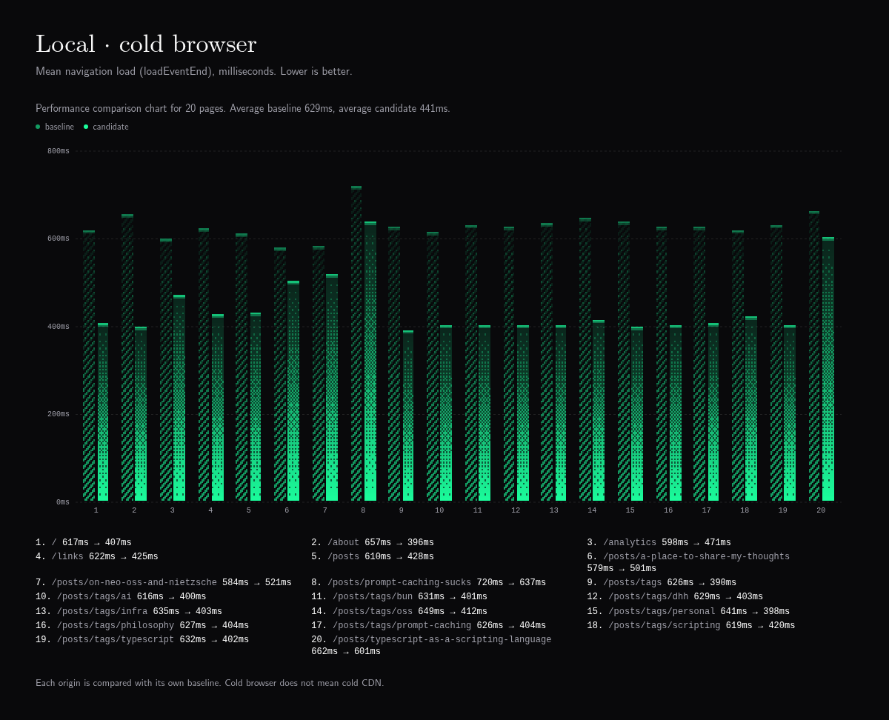
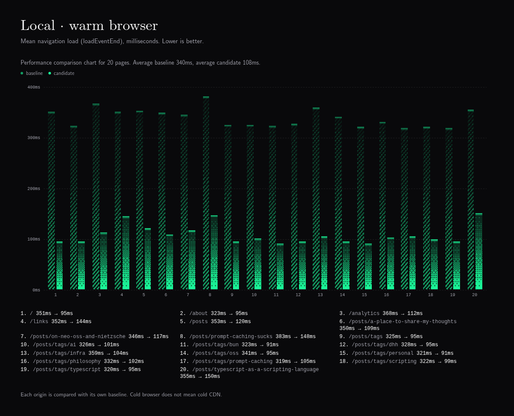
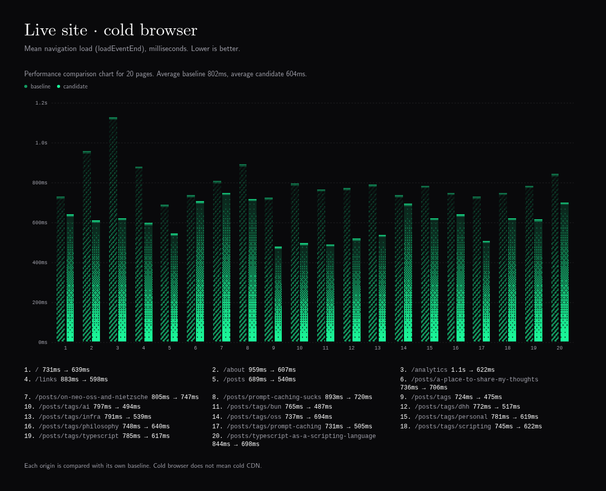
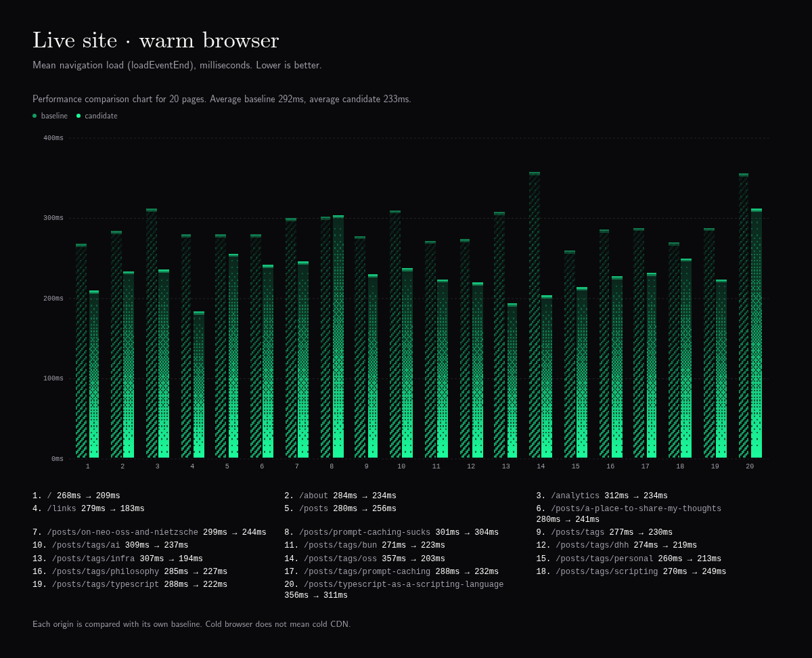

# caulk.lol public page performance report — 2026-09-05

Baseline: ef58f12c67d436eb70757302c7c278e24d7077ba (baseline-complete-rounds)
Candidate: 78800cb04464616997a7356190c17fc200749125 (final-complete)
Browser: 151.0.7922.173. Harness: b6ef10e2e2c4296c4e378280eb3d691772b9ab3a0a0e8c69e1a50e948a2eb5e5.

## Result

The site does less work and loads faster in most measured cases. The original
3× target was **not achieved**. Zero accepted closing this pass with the misses
documented; the benchmark threshold has not been lowered.

These are arithmetic means across all 20 pages, with equal page weight. The
speedup column divides the aggregate baseline load mean by the candidate mean;
the later overview also reports the distinct arithmetic mean of per-page ratios.

| Scope               | Mean load before → after | Load speedup | Mean readiness before → after |
| ------------------- | -----------------------: | -----------: | ----------------------------: |
| Local, cold browser |         629.0 → 441.3 ms |        1.43× |              931.1 → 663.5 ms |
| Local, warm browser |         339.8 → 108.2 ms |        3.14× |              483.4 → 202.9 ms |
| Live, cold browser  |         802.3 → 604.3 ms |        1.33× |            1206.7 → 1014.5 ms |
| Live, warm browser  |         292.2 → 233.3 ms |        1.25× |              441.0 → 355.2 ms |

Fifteen of 80 combinations reached 3× mean load speed, all local/warm. None
reached 3× mean readiness, so **all 80 miss the combined gate**. Readiness
improved in every cell. One load regression remains: live/warm
`/posts/prompt-caching-sucks`, approximately 1.2% slower. Three samples per cell,
live network variance, and simultaneous content edits do not establish its cause.

The homepage's local warm mean load fell from 350.9 to 94.9 ms; readiness fell
from 473.2 to 170.0 ms. Live cold homepage transfer fell from approximately
434.5 KB to 232.7 KB, while load improved from 730.8 to 638.5 ms. Less transfer
does not guarantee a proportional timing improvement.

## Changes shipped

- **Serve generated HTML.** Published pages read exact prerender artifacts from
  the Worker asset binding. The Worker retains telemetry; missing artifacts fail
  visibly. Hashed assets use a year of immutable caching, HTML a short freshness
  window, and unhashed fonts a separate policy.
- **Finish the shared header.** The public header now belongs to the root layout,
  so its navigation and theme controls can initialize independently of lazy page
  content. Desktop/mobile controls, hotkeys, focus, and browser history remain.
- **Finish image loading.** Article images retain the Fumadocs image component and
  use native lazy loading, with an explicit eager override available. Scrolling
  and image decoding are tested separately from the load event.
- **Preload actual dependencies.** A pinned TanStack Start manifest patch walks
  transitive static imports with cycle protection. A build plugin maps each MDX
  article to its emitted entry and static imports. Dynamic optional widgets stay
  separate. Tests exercise the installed manifest builder and plugin lifecycle.
- **Keep expensive authoring work out of the reader's browser.** Excalidraw SVGs
  are generated ahead of time; editable scenes and freshness hashes remain.
  Optional MDX widgets have separate imports. Date labels reuse Intl formatters.
- **Retain fonts and animation with less work.** CMU WOFF2 core/extension subsets
  preserve coverage, outlines, metrics, and styles. The core subset step alone
  reduces four common WOFF2 faces from 92,924 to 59,744 bytes. Unchanged star
  frames retain their pixels; an empty asteroid layer is not cleared every frame.
  The footer reveal uses CSS and an intersection observer. Regression tests
  cover twinkle state, random draws, motion, final trail clearing, and font files.
- **Replace VisX with Dither Kit.** The official CLI installed area/bar charts and
  the shared engine, recording `apps/blog/dither-kit.json`. Analytics uses a p95
  area and p50 line. The route network uses native SVG and retains hover, focus,
  tooltips, zoom, wheel interaction, pan, and reset. Report charts use measured
  data, visible page keys, and an accessible table. Canvas greens sample the
  active Tailwind `--primary` and `--background`, including theme changes.

The retained software updates include Node 24.20.0, pnpm 11.25.0, Alchemy 0.94.0,
React 19.2.8, TanStack React Start 1.168.49, Fumadocs core/UI 16.15.7, Fumadocs MDX
15.4.0, and Wrangler 4.129.0. Dither CLI 0.1.1 installed registry components
0.1.0. See the vendor notes for official sources and local patches.

## Deployment and feature verification

The measured application revision is `78800cb04464616997a7356190c17fc200749125`.
[Deployment CI passed](https://github.com/cau1k/caulk.lol/actions/runs/33947734510).
Deployment used a push to `main`; no local production deployment was run.
An initial CI failure exposed an extensionless infrastructure import. The
explicit `.ts` import, matching TypeScript setting, and a native-Node import
regression test fixed it. Clean CI installation used the frozen lockfile.
The final handoff check also caught consumers of that exported TypeScript graph;
the import setting now lives in the shared base and standalone blog configs. CI checks workspace lint
and types before deployment. These final configuration/report commits follow the
measured application revision; it is not a new timing run.

The new CI typecheck also exposed missing route trees in a clean checkout. Both
frontend typecheck scripts now resolve their existing Vite build configuration
first. TanStack's `configResolved` hook generates the route types and Start
registration footer without starting a server or running a build. Generator
errors fail the command. A separate checkout without generated routes or Alchemy
state regenerated both trees byte-for-byte and passed both frontend typechecks.
That check also exposed two undeclared type imports: the syntax theme now uses
the existing `@shikijs/types` dependency, and `@types/hast` 3.0.5 is declared
directly. These are type-only dependency fixes and add no browser runtime.

Validation completed: full workspace build and typecheck; root lint; 19 blog
regressions; two infrastructure tests; three benchmark tests, including real
bandwidth/latency emulation; and font generator coverage/outline/metric checks.

The browser feature suite passed **35 local and 35 live checks** across all 20
pages and 15 public resources. It exercised navigation, mobile menu and focus,
theme controls/hotkey, archive/tag coverage, article copy/open controls, prose,
accordions, images, SVG diagrams, Links and previews, Analytics, stars, footer,
search, Markdown, and OG images. All four live articles match the final local
content fingerprints. A separate populated Analytics fixture passed theme
repainting, tooltip fields, zoom/wheel/pan/reset/focus, and mobile containment.
That intercepted fixture was never used for timing measurements.

## Measurement provenance and limits

- **Scope:** 20 canonical public HTML pages; admin pages and drafts excluded.
  Three samples in each of 80 origin/cache/page cells: 240 baseline and 240 final
  candidate samples. Final candidate samples contain zero errors.
- **Baseline:** first three complete balanced rounds from the preserved original
  run. Later rounds had a timeout and local preview exit. The 12 baseline
  Analytics React #418 errors remain recorded with their actual timings.
- **Interrupted final attempts:** `final-deployed` and `final-paired` are retained
  under `test-results/performance/`. Wrangler's CLI exited with a blank error;
  no application exception, OOM, or core dump established the cause.
- **Local preview difference:** the successful candidate used Wrangler's
  `unstable_startWorker` API with debugger, registry, and watching disabled. It
  ran the same production bundle, routing, local bindings, and persisted data.
  The baseline used the CLI. Local comparisons therefore also include a preview
  tooling change; the live comparison does not. Browser/timing code and its hash
  remained unchanged. The candidate's dirty flag records local harness/report
  work after the deployed commit, not unpublished application changes.
- **Network repair:** Docker interface churn interrupted `/posts` in
  `final-verified`. After that full run finished, the entire page was remeasured
  with three cold/warm rounds on both origins. All 12 `/posts` samples were
  replaced by `final-posts-repair`; the other 228 samples were retained. Selection
  was based on the infrastructure error, not duration. The merger rejects
  unknown/app errors, duplicate runs, changed profiles, and incomplete repairs.
- **Content changed:** Zero edited the Nietzsche and prompt-caching articles
  during the pass. Their timings include those content changes. The other two
  article fingerprints are unchanged from earlier checks.
- **Interpretation:** cold means an empty browser cache, not an empty Cloudflare
  cache. Local Links uses captured fixtures; local Analytics lacks production
  credentials. Readiness is a global startup/paint/font/data signal, not proof
  that every optional widget has hydrated. Separate interaction tests cover that
  gap. The single host and emulated connection do not represent all visitors;
  three samples do not support strong statistical confidence claims.

## Evidence and reproduction

Compressed raw measurements are preserved with this report:
[baseline](data/baseline.json.gz), [final candidate](data/candidate.json.gz),
[unrepaired full run](data/unrepaired.json.gz), and
[archive-page repair](data/repair.json.gz). They include individual timings,
resource waterfalls, response cache headers, long tasks, errors, and provenance.
Feature evidence: [local](data/features-local.json),
[live](data/features-live.json). Full screenshots and interrupted attempts remain
in the workspace's `test-results/performance/` directory.

```sh
PERF_CHROMIUM=/usr/bin/chromium pnpm perf --serve --runs 3 --label next
node scripts/performance/export.mjs \
  --baseline test-results/performance/baseline-complete-rounds.json \
  --candidate test-results/performance/final-complete.json \
  --notes docs/performance/verification.md
node scripts/performance/charts.mjs
```

Run comparisons only with matching browser/profile/hash and all required cells.
Keep build and browser jobs out of the timing run. Generated SVG/font and
TanStack patch tests belong in the upgrade gate. Dither update instructions and
local source adjustments live in
`apps/blog/src/components/dither-kit/NOTES.md`; the full suite is documented in
`scripts/performance/README.md`.


## Methodology

The runner measures every public page as paired local and live browser navigations, with cold and warm browser cache cells. Cold means empty browser cache and storage for that browser context. It does not prove a cold Cloudflare edge cache; CDN cache state stays visible in response headers and should be interpreted separately.

Profile: 1440x900, dark mode, 4x CPU throttle, 40 ms latency, 1250 KB/s down, 625 KB/s up, global-empty-url-pattern. Baseline rounds: 3. Candidate rounds: 3.

Load is the browser navigation load event. Ready is stricter: the maximum of load, observed LCP, app hydration, and route readiness markers such as the theme control being hydrated. Errors stay errors and never become fast samples.

The baseline retains all 240 timed samples from the first three complete, balanced rounds, including the Analytics errors described below. Later rounds had a readiness timeout and a local workerd abort; the full original run remains preserved separately.
The final scope accepts measured improvements with every missed 3× target documented. The original per-cell load-and-readiness gate remains unchanged in the results.
Baseline browser errors were preserved, not hidden: 12 samples across 4 cells: Browser errors: Minified React error #418; visit https://react.dev/errors/418?args[]=text&args[]= for the full message or use the non-minified dev environment for full errors and additional helpful warnings..

## Chart exports






Light variants: [local cold](assets/local-cold-light.png), [local warm](assets/local-warm-light.png), [live cold](assets/live-cold-light.png), [live warm](assets/live-warm-light.png).

## Equal-page overview

These overview ratios are arithmetic means across pages, with equal page weight. The gate still applies to every page/origin/cache cell independently.

| Scope | Pages | Passed | Missed | Mean load ratio | Mean ready ratio |
|---|---:|---:|---:|---:|---:|
| liveCold | 20 | 0 | 20 | 1.35× | 1.20× |
| liveWarm | 20 | 0 | 20 | 1.27× | 1.24× |
| localCold | 20 | 0 | 20 | 1.45× | 1.41× |
| localWarm | 20 | 0 | 20 | 3.20× | 2.40× |

## Explicit misses

- live cold /: load 1.14×, ready 1.23×.
- live cold /about: load 1.58×, ready 1.44×.
- live cold /analytics: load 1.82×, ready 1.17×.
- live cold /links: load 1.48×, ready 1.33×.
- live cold /posts: load 1.28×, ready 1.12×.
- live cold /posts/a-place-to-share-my-thoughts: load 1.04×, ready 1.10×.
- live cold /posts/on-neo-oss-and-nietzsche: load 1.08×, ready 1.03×.
- live cold /posts/prompt-caching-sucks: load 1.24×, ready 1.19×.
- live cold /posts/tags: load 1.52×, ready 1.29×.
- live cold /posts/tags/ai: load 1.61×, ready 1.18×.
- live cold /posts/tags/bun: load 1.57×, ready 1.28×.
- live cold /posts/tags/dhh: load 1.49×, ready 1.33×.
- live cold /posts/tags/infra: load 1.47×, ready 1.27×.
- live cold /posts/tags/oss: load 1.06×, ready 1.04×.
- live cold /posts/tags/personal: load 1.26×, ready 1.13×.
- live cold /posts/tags/philosophy: load 1.17×, ready 1.12×.
- live cold /posts/tags/prompt-caching: load 1.45×, ready 1.23×.
- live cold /posts/tags/scripting: load 1.20×, ready 1.08×.
- live cold /posts/tags/typescript: load 1.27×, ready 1.10×.
- live cold /posts/typescript-as-a-scripting-language: load 1.21×, ready 1.27×.
- live warm /: load 1.28×, ready 1.34×.
- live warm /about: load 1.22×, ready 1.17×.
- live warm /analytics: load 1.33×, ready 1.05×.
- live warm /links: load 1.52×, ready 1.54×.
- live warm /posts: load 1.10×, ready 1.13×.
- live warm /posts/a-place-to-share-my-thoughts: load 1.16×, ready 1.19×.
- live warm /posts/on-neo-oss-and-nietzsche: load 1.22×, ready 1.29×.
- live warm /posts/prompt-caching-sucks: load 0.99×, ready 1.35×.
- live warm /posts/tags: load 1.20×, ready 1.11×.
- live warm /posts/tags/ai: load 1.31×, ready 1.26×.
- live warm /posts/tags/bun: load 1.21×, ready 1.15×.
- live warm /posts/tags/dhh: load 1.25×, ready 1.16×.
- live warm /posts/tags/infra: load 1.58×, ready 1.36×.
- live warm /posts/tags/oss: load 1.76×, ready 1.43×.
- live warm /posts/tags/personal: load 1.22×, ready 1.12×.
- live warm /posts/tags/philosophy: load 1.25×, ready 1.14×.
- live warm /posts/tags/prompt-caching: load 1.24×, ready 1.22×.
- live warm /posts/tags/scripting: load 1.08×, ready 1.06×.
- live warm /posts/tags/typescript: load 1.30×, ready 1.22×.
- live warm /posts/typescript-as-a-scripting-language: load 1.14×, ready 1.54×.
- local cold /: load 1.52×, ready 1.45×.
- local cold /about: load 1.66×, ready 1.61×.
- local cold /analytics: load 1.27×, ready 1.30×.
- local cold /links: load 1.47×, ready 1.45×.
- local cold /posts: load 1.42×, ready 1.35×.
- local cold /posts/a-place-to-share-my-thoughts: load 1.15×, ready 1.36×.
- local cold /posts/on-neo-oss-and-nietzsche: load 1.12×, ready 1.24×.
- local cold /posts/prompt-caching-sucks: load 1.13×, ready 1.42×.
- local cold /posts/tags: load 1.61×, ready 1.51×.
- local cold /posts/tags/ai: load 1.54×, ready 1.37×.
- local cold /posts/tags/bun: load 1.57×, ready 1.44×.
- local cold /posts/tags/dhh: load 1.56×, ready 1.48×.
- local cold /posts/tags/infra: load 1.57×, ready 1.46×.
- local cold /posts/tags/oss: load 1.57×, ready 1.41×.
- local cold /posts/tags/personal: load 1.61×, ready 1.43×.
- local cold /posts/tags/philosophy: load 1.55×, ready 1.39×.
- local cold /posts/tags/prompt-caching: load 1.55×, ready 1.32×.
- local cold /posts/tags/scripting: load 1.47×, ready 1.32×.
- local cold /posts/tags/typescript: load 1.57×, ready 1.47×.
- local cold /posts/typescript-as-a-scripting-language: load 1.10×, ready 1.39×.
- local warm /: load 3.70×, ready 2.78×.
- local warm /about: load 3.40×, ready 2.82×.
- local warm /analytics: load 3.27×, ready 2.02×.
- local warm /links: load 2.44×, ready 2.10×.
- local warm /posts: load 2.94×, ready 2.31×.
- local warm /posts/a-place-to-share-my-thoughts: load 3.21×, ready 2.41×.
- local warm /posts/on-neo-oss-and-nietzsche: load 2.95×, ready 2.29×.
- local warm /posts/prompt-caching-sucks: load 2.59×, ready 2.47×.
- local warm /posts/tags: load 3.41×, ready 2.50×.
- local warm /posts/tags/ai: load 3.24×, ready 2.30×.
- local warm /posts/tags/bun: load 3.54×, ready 2.39×.
- local warm /posts/tags/dhh: load 3.47×, ready 2.48×.
- local warm /posts/tags/infra: load 3.44×, ready 2.50×.
- local warm /posts/tags/oss: load 3.58×, ready 2.59×.
- local warm /posts/tags/personal: load 3.53×, ready 2.40×.
- local warm /posts/tags/philosophy: load 3.27×, ready 2.36×.
- local warm /posts/tags/prompt-caching: load 3.05×, ready 2.09×.
- local warm /posts/tags/scripting: load 3.25×, ready 2.31×.
- local warm /posts/tags/typescript: load 3.37×, ready 2.34×.
- local warm /posts/typescript-as-a-scripting-language: load 2.37×, ready 2.48×.

## All cells

| Origin | Cache | Page | n/errors | Load before | Load after | Load ratio | Ready before | Ready after | Ready ratio | FCP ratio | LCP ratio | Gate |
|---|---|---|---:|---:|---:|---:|---:|---:|---:|---:|---:|---|
| live | cold | / | 3/0 | 730.8 | 638.5 | 1.14× | 1176.2 | 955.2 | 1.23× | 0.95× | 0.95× | FAIL |
| live | cold | /about | 3/0 | 959.2 | 607.5 | 1.58× | 1366.8 | 951.5 | 1.44× | 1.41× | 1.41× | FAIL |
| live | cold | /analytics | 3/0 | 1129.4 | 621.8 | 1.82× | 1816.5 | 1548.8 | 1.17× | 1.54× | 1.54× | FAIL |
| live | cold | /links | 3/0 | 882.7 | 597.9 | 1.48× | 1256.7 | 946.9 | 1.33× | 1.14× | 1.14× | FAIL |
| live | cold | /posts | 3/0 | 688.7 | 540.0 | 1.28× | 1111.2 | 995.9 | 1.12× | 1.17× | 1.17× | FAIL |
| live | cold | /posts/a-place-to-share-my-thoughts | 3/0 | 736.1 | 706.2 | 1.04× | 1242.9 | 1128.3 | 1.10× | 0.81× | 0.81× | FAIL |
| live | cold | /posts/on-neo-oss-and-nietzsche | 3/0 | 805.1 | 746.5 | 1.08× | 1231.5 | 1200.7 | 1.03× | 0.78× | 0.78× | FAIL |
| live | cold | /posts/prompt-caching-sucks | 3/0 | 892.9 | 719.9 | 1.24× | 1416.2 | 1185.5 | 1.19× | 0.97× | 0.97× | FAIL |
| live | cold | /posts/tags | 3/0 | 724.1 | 475.3 | 1.52× | 1042.1 | 805.7 | 1.29× | 1.27× | 1.27× | FAIL |
| live | cold | /posts/tags/ai | 3/0 | 797.3 | 493.7 | 1.61× | 1036.9 | 881.9 | 1.18× | 1.20× | 1.20× | FAIL |
| live | cold | /posts/tags/bun | 3/0 | 765.5 | 487.3 | 1.57× | 1075.7 | 840.4 | 1.28× | 1.27× | 1.27× | FAIL |
| live | cold | /posts/tags/dhh | 3/0 | 771.6 | 517.3 | 1.49× | 1158.2 | 873.0 | 1.33× | 1.17× | 1.17× | FAIL |
| live | cold | /posts/tags/infra | 3/0 | 791.4 | 539.2 | 1.47× | 1147.4 | 903.4 | 1.27× | 1.09× | 1.09× | FAIL |
| live | cold | /posts/tags/oss | 3/0 | 736.9 | 694.2 | 1.06× | 1095.8 | 1057.2 | 1.04× | 0.83× | 0.83× | FAIL |
| live | cold | /posts/tags/personal | 3/0 | 781.0 | 618.6 | 1.26× | 1107.0 | 979.7 | 1.13× | 0.97× | 0.97× | FAIL |
| live | cold | /posts/tags/philosophy | 3/0 | 748.4 | 639.7 | 1.17× | 1121.0 | 1003.1 | 1.12× | 0.97× | 0.97× | FAIL |
| live | cold | /posts/tags/prompt-caching | 3/0 | 731.0 | 505.3 | 1.45× | 1077.1 | 874.7 | 1.23× | 1.25× | 1.25× | FAIL |
| live | cold | /posts/tags/scripting | 3/0 | 745.4 | 622.2 | 1.20× | 1087.5 | 1003.5 | 1.08× | 0.94× | 0.94× | FAIL |
| live | cold | /posts/tags/typescript | 3/0 | 785.1 | 616.8 | 1.27× | 1074.1 | 978.8 | 1.10× | 0.93× | 0.93× | FAIL |
| live | cold | /posts/typescript-as-a-scripting-language | 3/0 | 843.8 | 698.4 | 1.21× | 1493.3 | 1175.6 | 1.27× | 1.13× | 1.13× | FAIL |
| live | warm | / | 3/0 | 267.5 | 209.2 | 1.28× | 406.0 | 302.0 | 1.34× | 2.28× | 2.28× | FAIL |
| live | warm | /about | 3/0 | 284.4 | 233.8 | 1.22× | 399.4 | 341.1 | 1.17× | 1.82× | 1.82× | FAIL |
| live | warm | /analytics | 3/0 | 312.2 | 234.2 | 1.33× | 491.0 | 467.2 | 1.05× | 1.65× | 1.65× | FAIL |
| live | warm | /links | 3/0 | 278.6 | 183.2 | 1.52× | 433.0 | 280.5 | 1.54× | 1.35× | 1.35× | FAIL |
| live | warm | /posts | 3/0 | 280.2 | 255.6 | 1.10× | 397.4 | 350.2 | 1.13× | 1.86× | 1.86× | FAIL |
| live | warm | /posts/a-place-to-share-my-thoughts | 3/0 | 279.9 | 240.7 | 1.16× | 483.4 | 407.0 | 1.19× | 1.57× | 1.57× | FAIL |
| live | warm | /posts/on-neo-oss-and-nietzsche | 3/0 | 299.0 | 244.5 | 1.22× | 518.8 | 401.7 | 1.29× | 2.04× | 2.04× | FAIL |
| live | warm | /posts/prompt-caching-sucks | 3/0 | 300.8 | 304.3 | 0.99× | 604.6 | 447.8 | 1.35× | 1.46× | 1.46× | FAIL |
| live | warm | /posts/tags | 3/0 | 276.8 | 230.1 | 1.20× | 386.4 | 347.7 | 1.11× | 2.07× | 2.07× | FAIL |
| live | warm | /posts/tags/ai | 3/0 | 308.9 | 236.5 | 1.31× | 421.8 | 333.5 | 1.26× | 2.62× | 2.62× | FAIL |
| live | warm | /posts/tags/bun | 3/0 | 270.6 | 223.1 | 1.21× | 361.5 | 314.1 | 1.15× | 2.31× | 2.31× | FAIL |
| live | warm | /posts/tags/dhh | 3/0 | 274.0 | 219.1 | 1.25× | 387.4 | 333.1 | 1.16× | 1.90× | 1.90× | FAIL |
| live | warm | /posts/tags/infra | 3/0 | 307.2 | 194.0 | 1.58× | 433.5 | 319.5 | 1.36× | 2.51× | 2.51× | FAIL |
| live | warm | /posts/tags/oss | 3/0 | 357.0 | 203.4 | 1.76× | 460.9 | 322.0 | 1.43× | 2.54× | 2.54× | FAIL |
| live | warm | /posts/tags/personal | 3/0 | 260.1 | 213.4 | 1.22× | 352.5 | 314.8 | 1.12× | 2.03× | 2.03× | FAIL |
| live | warm | /posts/tags/philosophy | 3/0 | 284.7 | 227.0 | 1.25× | 391.4 | 343.9 | 1.14× | 2.07× | 2.07× | FAIL |
| live | warm | /posts/tags/prompt-caching | 3/0 | 287.9 | 231.6 | 1.24× | 408.3 | 335.4 | 1.22× | 2.16× | 2.16× | FAIL |
| live | warm | /posts/tags/scripting | 3/0 | 269.5 | 248.8 | 1.08× | 372.6 | 352.9 | 1.06× | 2.15× | 2.15× | FAIL |
| live | warm | /posts/tags/typescript | 3/0 | 288.2 | 222.4 | 1.30× | 403.6 | 330.4 | 1.22× | 2.11× | 2.11× | FAIL |
| live | warm | /posts/typescript-as-a-scripting-language | 3/0 | 355.5 | 310.9 | 1.14× | 707.5 | 459.9 | 1.54× | 1.82× | 1.82× | FAIL |
| local | cold | / | 3/0 | 617.4 | 406.7 | 1.52× | 894.6 | 616.0 | 1.45× | 1.13× | 1.13× | FAIL |
| local | cold | /about | 3/0 | 657.0 | 396.2 | 1.66× | 899.6 | 558.3 | 1.61× | 1.26× | 1.26× | FAIL |
| local | cold | /analytics | 3/0 | 598.3 | 471.3 | 1.27× | 1074.8 | 825.1 | 1.30× | 0.93× | 0.93× | FAIL |
| local | cold | /links | 3/0 | 622.4 | 424.6 | 1.47× | 888.1 | 610.6 | 1.45× | 0.98× | 0.98× | FAIL |
| local | cold | /posts | 3/0 | 609.8 | 428.3 | 1.42× | 859.1 | 634.3 | 1.35× | 1.00× | 1.00× | FAIL |
| local | cold | /posts/a-place-to-share-my-thoughts | 3/0 | 578.6 | 501.1 | 1.15× | 1020.4 | 748.7 | 1.36× | 0.96× | 0.96× | FAIL |
| local | cold | /posts/on-neo-oss-and-nietzsche | 3/0 | 584.1 | 520.6 | 1.12× | 950.7 | 765.9 | 1.24× | 0.92× | 2.43× | FAIL |
| local | cold | /posts/prompt-caching-sucks | 3/0 | 719.6 | 637.4 | 1.13× | 1283.7 | 903.7 | 1.42× | 0.87× | 0.87× | FAIL |
| local | cold | /posts/tags | 3/0 | 626.4 | 389.7 | 1.61× | 840.5 | 556.8 | 1.51× | 1.25× | 1.25× | FAIL |
| local | cold | /posts/tags/ai | 3/0 | 616.3 | 400.3 | 1.54× | 853.6 | 621.5 | 1.37× | 1.11× | 1.11× | FAIL |
| local | cold | /posts/tags/bun | 3/0 | 630.7 | 400.6 | 1.57× | 854.5 | 595.3 | 1.44× | 1.16× | 1.16× | FAIL |
| local | cold | /posts/tags/dhh | 3/0 | 628.6 | 403.0 | 1.56× | 877.5 | 594.4 | 1.48× | 1.16× | 1.16× | FAIL |
| local | cold | /posts/tags/infra | 3/0 | 635.1 | 403.5 | 1.57× | 914.2 | 624.2 | 1.46× | 1.13× | 1.13× | FAIL |
| local | cold | /posts/tags/oss | 3/0 | 649.1 | 412.5 | 1.57× | 914.5 | 647.8 | 1.41× | 1.18× | 1.18× | FAIL |
| local | cold | /posts/tags/personal | 3/0 | 640.6 | 398.2 | 1.61× | 878.7 | 616.0 | 1.43× | 1.18× | 1.18× | FAIL |
| local | cold | /posts/tags/philosophy | 3/0 | 626.6 | 403.5 | 1.55× | 848.1 | 611.1 | 1.39× | 1.10× | 1.10× | FAIL |
| local | cold | /posts/tags/prompt-caching | 3/0 | 625.8 | 404.3 | 1.55× | 829.0 | 627.0 | 1.32× | 1.11× | 1.11× | FAIL |
| local | cold | /posts/tags/scripting | 3/0 | 619.4 | 420.3 | 1.47× | 831.8 | 628.8 | 1.32× | 1.03× | 1.03× | FAIL |
| local | cold | /posts/tags/typescript | 3/0 | 631.9 | 402.3 | 1.57× | 896.6 | 611.8 | 1.47× | 1.12× | 1.12× | FAIL |
| local | cold | /posts/typescript-as-a-scripting-language | 3/0 | 662.1 | 601.1 | 1.10× | 1211.6 | 872.0 | 1.39× | 0.96× | 0.96× | FAIL |
| local | warm | / | 3/0 | 350.9 | 94.9 | 3.70× | 473.2 | 170.0 | 2.78× | 3.80× | 3.80× | FAIL |
| local | warm | /about | 3/0 | 323.0 | 95.1 | 3.40× | 460.9 | 163.2 | 2.82× | 3.46× | 3.46× | FAIL |
| local | warm | /analytics | 3/0 | 367.8 | 112.3 | 3.27× | 530.9 | 262.3 | 2.02× | 2.25× | 2.25× | FAIL |
| local | warm | /links | 3/0 | 352.1 | 144.2 | 2.44× | 481.7 | 229.0 | 2.10× | 2.19× | 2.19× | FAIL |
| local | warm | /posts | 3/0 | 353.0 | 119.9 | 2.94× | 468.3 | 202.3 | 2.31× | 2.81× | 2.81× | FAIL |
| local | warm | /posts/a-place-to-share-my-thoughts | 3/0 | 349.6 | 108.9 | 3.21× | 545.3 | 226.5 | 2.41× | 3.27× | 3.27× | FAIL |
| local | warm | /posts/on-neo-oss-and-nietzsche | 3/0 | 345.9 | 117.3 | 2.95× | 558.7 | 244.4 | 2.29× | 2.33× | 5.51× | FAIL |
| local | warm | /posts/prompt-caching-sucks | 3/0 | 382.7 | 147.7 | 2.59× | 668.9 | 271.2 | 2.47× | 2.27× | 2.27× | FAIL |
| local | warm | /posts/tags | 3/0 | 325.0 | 95.3 | 3.41× | 437.4 | 174.7 | 2.50× | 3.67× | 3.67× | FAIL |
| local | warm | /posts/tags/ai | 3/0 | 325.6 | 100.6 | 3.24× | 429.8 | 187.2 | 2.30× | 3.35× | 3.35× | FAIL |
| local | warm | /posts/tags/bun | 3/0 | 322.8 | 91.2 | 3.54× | 417.1 | 174.4 | 2.39× | 3.98× | 3.98× | FAIL |
| local | warm | /posts/tags/dhh | 3/0 | 328.1 | 94.5 | 3.47× | 436.1 | 176.0 | 2.48× | 3.05× | 3.05× | FAIL |
| local | warm | /posts/tags/infra | 3/0 | 358.8 | 104.2 | 3.44× | 489.1 | 195.8 | 2.50× | 3.71× | 3.71× | FAIL |
| local | warm | /posts/tags/oss | 3/0 | 341.2 | 95.2 | 3.58× | 459.4 | 177.7 | 2.59× | 3.39× | 3.39× | FAIL |
| local | warm | /posts/tags/personal | 3/0 | 321.3 | 91.1 | 3.53× | 422.9 | 176.1 | 2.40× | 3.78× | 3.78× | FAIL |
| local | warm | /posts/tags/philosophy | 3/0 | 332.5 | 101.8 | 3.27× | 439.2 | 186.2 | 2.36× | 3.45× | 3.45× | FAIL |
| local | warm | /posts/tags/prompt-caching | 3/0 | 319.1 | 104.7 | 3.05× | 422.2 | 202.0 | 2.09× | 3.47× | 3.47× | FAIL |
| local | warm | /posts/tags/scripting | 3/0 | 321.9 | 98.9 | 3.25× | 418.4 | 180.9 | 2.31× | 3.49× | 3.49× | FAIL |
| local | warm | /posts/tags/typescript | 3/0 | 320.3 | 95.1 | 3.37× | 421.4 | 180.2 | 2.34× | 2.93× | 2.93× | FAIL |
| local | warm | /posts/typescript-as-a-scripting-language | 3/0 | 355.3 | 150.2 | 2.37× | 687.9 | 277.5 | 2.48× | 2.11× | 2.11× | FAIL |
